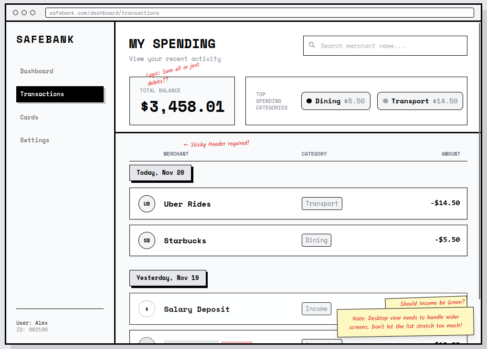

# Front-end Coding Challenge: SafeBank Transaction Feed
You have joined the "Money Management" team. We are prototyping a new feature that helps users track their spending habits. Your task is to build the MVP of the **Transaction List** component.

## The Task
Build a React application that renders a list of transactions with specific grouping and summary features. Choose the approach you think is best for this specific feature. Be prepared to explain your choice.

## Requirements

### 1. Core Features
- **Data Source:** Use the provided `data.json` file.
- **Transaction List:**
    - Render the list of transactions.
    - Group by Date: Transactions should be grouped under date headers (e.g., "Today", "Yesterday", "20. Nov")
    - Sticky Headers: As the user scrolls, the date header should stick to the top of the view
- **Summary Header:**
    - At the top of the screen, display the **Total Balance** calculated from the transaction list
    - Display a summary of **Expenses by Category**
- **Search:**
    - Add an input to filter transactions by Merchant name

### 2. Technical Requirements
- **Framework:** React 18+
- **Language:** TypeScript
- **Styling:** Your choice (CSS Modules, Tailwind, Styled Components, etc.)

### 3. Design
- A wireframe sketch is provided (`wireframe.png`) as a reference
- You have creative freedom to make it look "trustworthy" and "clean"
- Use standard banking conventions for colors (e.g., Credits vs Debits)

## Deliverable
- A git repository with your source code.
- A short `readme.md` explaining your architectural decisions, trade-offs, and how you handled the data.
